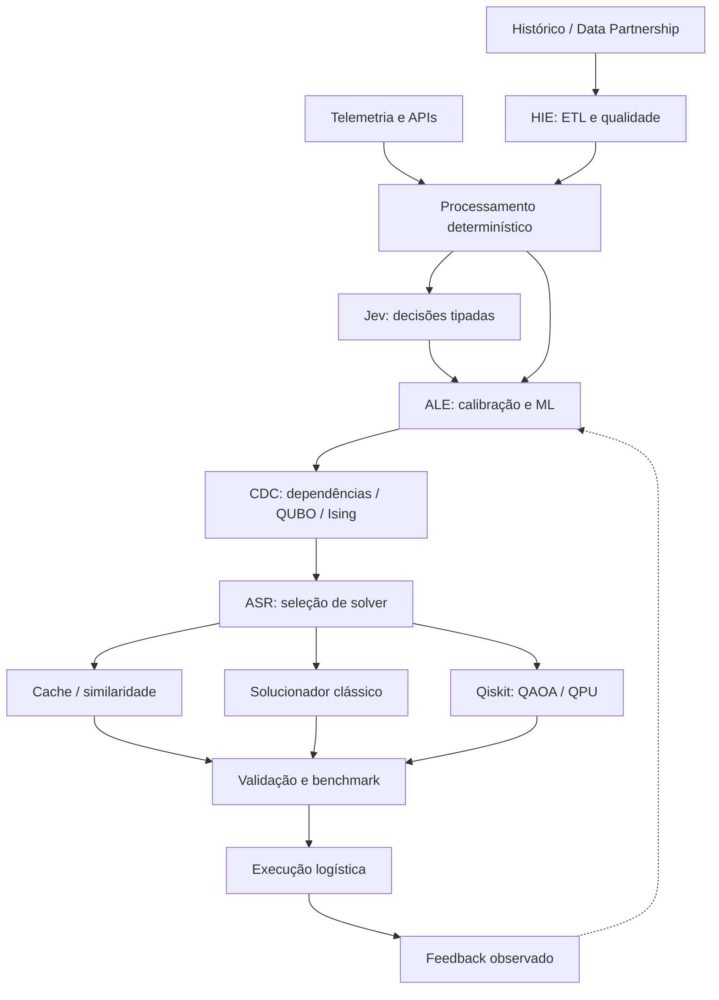

# Arquitetura proposta

```mermaid
flowchart TD
 H[Histórico / Data Partnership] --> I[HIE: ETL e qualidade]
 T[Telemetria e APIs] --> D[Processamento determinístico]
 I --> D
 D --> J[Jev: decisões tipadas]
 J --> A[ALE: calibração e ML]
 D --> A
 A --> C[CDC: dependências / QUBO / Ising]
 C --> R[ASR: seleção de solver]
 R --> M[Cache / similaridade]
 R --> K[Solucionador clássico]
 R --> Q[Qiskit: QAOA / QPU]
 M --> V[Validação e benchmark]
 K --> V
 Q --> V
 V --> E[Execução logística]
 E --> F[Feedback observado]
 F -.-> A
```

Proposta conceitual; nenhuma integração real foi demonstrada. Regras de segurança e validação são obrigatórias, independentemente do solver.
